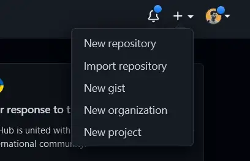

# How to add a React app to a GitHub repository

If you’re starting out with React and you want to click and drag your project to add it to a repository, you’ll realize that there’s a limit on the amount of files you can upload. As you know React apps have thousands of files so you can see this can get frustrating, don’t worry I will explain how to add this using Git on your terminal.

### 1.) Initialize Local Directory

In your projects folder enter the following command

```bash
  git init
```
### 2.) Add all the files in the local directory

```bash
  git add .
```

### 3.) Commit the files to the repository and add a message

```bash
  git commit -m "best commit ever"
```

### 4.) Create a new repository



### 5.) Enter a name and click “Create Repository”


### 6.) Copy the URL to the Clipboard


### 7.) Go back to your Terminal and set the origin by pasting the URL from the clipboard.

```bash
  git remote add origin http://Paste URL here
```
### 8.) Push your files from Local repository to GitHub


```bash
  git push -u origin master 
```

### And that’s it! You added your React project to your GitHub repository. If you need to push your code after modifications use this

```bash
git commit -m “message here”
git push -u origin master
```

### Feel free to check out my Medium blogs and connect with me on LinkedIn

[](https://medium.com/@carlosfxv)
[](https://www.linkedin.com/in/carlos-martinez-b66579214/)

### Author

[Carlos Martinez](https://www.github.com/cima9642)

